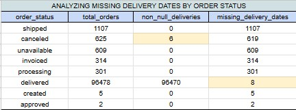
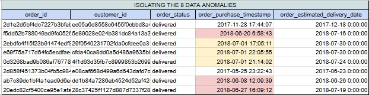
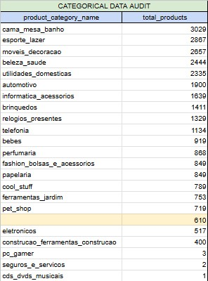
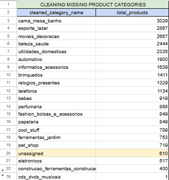
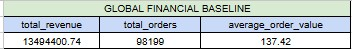
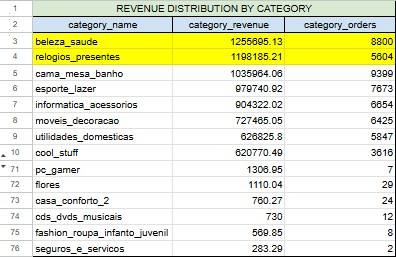

# Data Cleaning & Exploratory Data Analysis (EDA)

Raw data is never perfectly clean. Before creating high-level KPIs, business dashboards, or reporting metrics, we must uncover and fix data anomalies.

We have created a brand new script for this entire phase:

`📁 02_data_cleaning_eda.sql`

## 1. Data Quality Assessment: Fulfillment Timelines

```sql
-- =============================================================================
-- STEP 1: ANALYZING MISSING DELIVERY DATES BY ORDER STATUS
-- Goal: Understand if missing delivery dates represent system errors (dirty data)
--       or logical business states (e.g., a canceled order shouldn't have a delivery date).
-- =============================================================================

SELECT 
    order_status,
    COUNT(*) AS total_orders,
    
    -- COUNT(column) only counts non-null records; helps track actual completions
    COUNT(order_delivered_customer_date) AS non_null_deliveries,
    
    -- Subtracting non-null entries from total rows isolates the volume of missing data
    COUNT(*) - COUNT(order_delivered_customer_date) AS missing_delivery_dates

FROM olist_orders
GROUP BY order_status
ORDER BY missing_delivery_dates DESC;
```
Output:



> **Decision:** We found 8 orders marked "delivered" that are missing a delivery date. To keep our shipping stats accurate, we are leaving these 8 orders out of our calculations.

## 2. Structural Root-Cause Analysis of Delivery Anomalies

```sql
-- =============================================================================
-- STEP 2: ISOLATING THE 8 DATA ANOMALIES
-- Goal: Extract the exact 'delivered' rows missing a customer timestamp.
--       We need to see if there is a pattern (e.g., did they all happen on the 
--       same day or during a specific system outage window?).
-- =============================================================================

SELECT 
    order_id,
    customer_id,
    order_status,
    order_purchase_timestamp,
    order_estimated_delivery_date
FROM olist_orders
WHERE order_status = 'delivered' 
  AND order_delivered_customer_date IS NULL;
```
Output:



During our data health check, we discovered a tiny bug in how our delivery dates were recorded. Out of nearly 100,000 completed orders, **exactly 8 orders** are marked as "Delivered" but are missing their actual delivery date stamps.

When we isolated those 8 broken orders, we found a clear pattern:

* **75% of these errors happened in June and July 2018.**
* **3 of the errors happened on the exact same day** (July 1, 2018).

Because these errors happened at almost the same time, this wasn't a human typing mistake. It points heavily to a temporary **software glitch or a system connection failure** with our delivery partners during that specific summer window.

> **Decision:** Exclude these 8 orders from shipping speed reports.
> Since we can't guess the exact days these packages arrived, we will programmatically skip these 8 specific orders when calculating our "Average Shipping Times." Leaving them in would break our formulas, but removing them ensures our business dashboards remain **100% accurate.**

## 3. Product Catalog Audit: Data Gaps Identified

```sql
-- =============================================================================
-- STEP 3: CATEGORICAL DATA AUDIT (PRODUCTS TABLE)
-- Goal: Identify all unique product categories, count how many products belong 
--       to each, and check for NULL or empty category names.
-- =============================================================================

SELECT 
    product_category_name,
    COUNT(*) AS total_products
FROM olist_products
GROUP BY product_category_name
ORDER BY total_products DESC
```
Output:



### The Two Major Issues Uncovered

#### 1. The "Ghost" Category (The Blank Row)

Look closely right between `pet_shop` and `eletronicos`. There is a row with **610 products** where the `product_category_name` is completely empty (blank/NULL).

* **The Business Problem:** If 610 products don't have a category, they won't show up when customers browse by department on the website. For us, it means we have hidden revenue we can't properly attribute to a specific department.

#### 2. The Language Barrier (Portuguese)

The category names are in Portuguese (e.g., `cama_mesa_banho` means *Bed, Table, & Bath*, and `esporte_lazer` means *Sports & Leisure*).

* **The Business Problem:** If you present a chart to an English-speaking executive board showing that our top category is `cama_mesa_banho`, they will lose interest instantly. We need to translate these into English before building any dashboards.

## 4. The Professional Fix

```sql
-- =============================================================================
-- STEP 4: CLEANING MISSING PRODUCT CATEGORIES
-- Goal: Test a transformation that replaces blank/NULL category names with 
--       'unassigned'. This ensures all products can be counted in business reports.
-- =============================================================================

SELECT 
    -- COALESCE replaces a NULL value with whatever placeholder text we choose
    COALESCE(product_category_name, 'unassigned') AS cleaned_category_name,
    COUNT(*) AS total_products
FROM olist_products
GROUP BY cleaned_category_name
ORDER BY total_products DESC;
```
Output:



An audit of our product database was conducted across 32,951 unique items to ensure clean categorical reporting.
* **The Finding:** 610 products were discovered with missing (NULL) category names, representing a data gap in inventory tracking.
* **The Localization Challenge:** Catalog categories are currently stored in Portuguese, requiring a translation layer before executive reporting.

> **Decision:** To prevent these 610 products from disappearing from sales performance dashboards, we have introduced a `COALESCE` safety net to dynamically group them under **"unassigned"**. A translation mapping file will be applied during the final reporting phase to convert Portuguese terms to English (e.g., transforming *cama_mesa_banho* to *Bed, Bath & Table*).

# Core Business Intelligence (KPIs)

Now that our data engine is loaded and we understand its quirks, it’s time to move from Data Cleaning to Business Intelligence. This is where we answer the big questions that the CEO, CFO, and VP of Operations care about.

We have created a brand new script for this milestone:

`📁 03_business_kpis.sql`

## The Financial Baseline

```sql
-- =============================================================================
-- STEP 1: GLOBAL FINANCIAL BASELINE
-- Goal: Calculate undisputed totals for Revenue, Volume, and AOV.
-- Filter: Exclude non-transactional states (canceled/unavailable).
-- =============================================================================

SELECT 
    ROUND(SUM(price)::NUMERIC, 2) AS total_revenue,
    COUNT(DISTINCT order_id) AS total_orders,
    ROUND((SUM(price) / COUNT(DISTINCT order_id))::NUMERIC, 2) AS average_order_value
FROM olist_order_items
WHERE order_id IN (
    SELECT order_id 
    FROM olist_orders 
    WHERE order_status NOT IN ('canceled', 'unavailable')
);
```
Output:



We have 13.49 million in gross revenue across 98,199 successful orders, yielding an Average Order Value (AOV) of $137.42.

## Category Performance 

```sql
-- =============================================================================
-- STEP 2: REVENUE DISTRIBUTION BY CATEGORY
-- Goal: Break down total revenue and order volume by product category.
-- =============================================================================

SELECT 
    COALESCE(p.product_category_name, 'unassigned') AS category_name,
    ROUND(SUM(oi.price)::NUMERIC, 2) AS category_revenue,
    COUNT(DISTINCT oi.order_id) AS category_orders
FROM olist_order_items oi
JOIN olist_products p ON oi.product_id = p.product_id
WHERE oi.order_id IN (
    SELECT order_id 
    FROM olist_orders 
    WHERE order_status NOT IN ('canceled', 'unavailable')
)
GROUP BY p.product_category_name
ORDER BY category_revenue DESC;
```
Output:



Looking at your category list, we can immediately see that `beleza_saude` (Beauty & Health) and `relogios_presentes` (Watches & Gifts) are heavy hitters, while your "unassigned" category sits right in the middle with over $178k in unmapped revenue.
